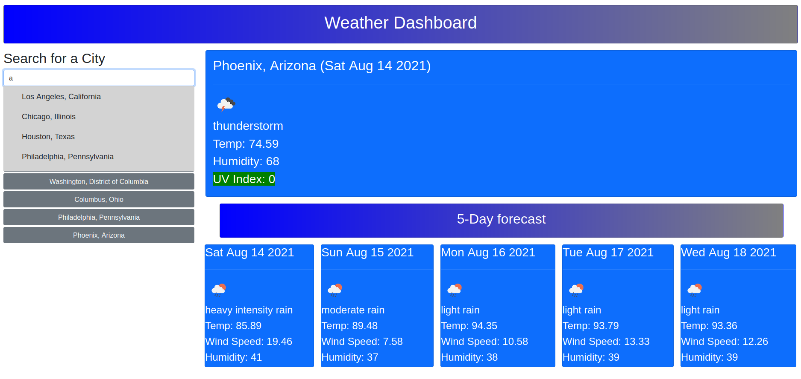
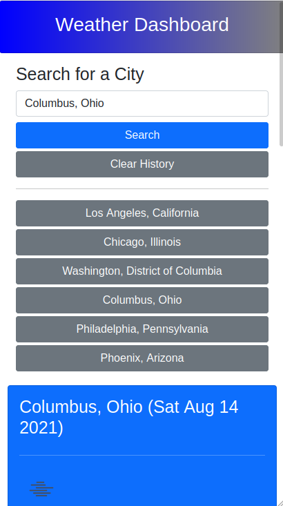

# weather-dashboard

## Description

This project aims to provide a weather dashboard where a user can enter the name of
a city and be provided with both current weather and a 5-day forecast of that city.
Indicators deemed relevant for this dashboard include, temperature, wind speed and
UV index. The search history of cities is also stored on the user's machine locally

Desktop Layout

 * Autocomplete is based off user's local storage state on load combined with [a list of US cities](https://gist.github.com/Miserlou/c5cd8364bf9b2420bb29) filtered to only include those with populations greater than 100,000

Mobile Layout

## APIs

[Open Weather OneCall API](https://openweathermap.org/api/one-call-api)